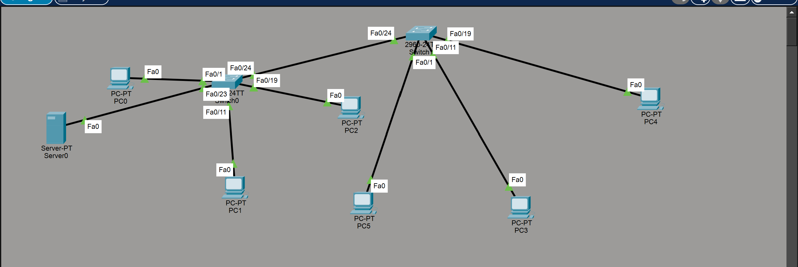

# Cisco-VLAN-Configuration

## 📡 Network Topology Overview

This project demonstrates a **multi-VLAN network setup** using Cisco switches and a router.  
It focuses on **network segmentation** for different departments to improve security, performance, and manageability.

---

## 🏗 Network Architecture

### Devices Used

- 2 Cisco Switches (Switch0 and 2960-24TT)
- 1 Router (2901)
- 1 Server (Server0)
- 6 PCs (PC0–PC5)

---

## 🌐 IP Address Scheme

| Device | IP Address |
|--------|------------|
| PC0 | 192.168.1.101 |
| PC1 | 192.168.1.102 |
| PC2 | 192.168.1.103 |
| PC3 | 192.168.1.105 |
| PC4 | 192.168.1.106 |
| PC5 | 192.168.1.104 |

---

## 🔀 VLAN Configuration

### VLAN Design

| VLAN ID | VLAN Name | Purpose | Assigned Ports | Devices in VLAN |
|--------|-----------|---------|---------------|----------------|
| 10 | ACCOUNT | Accounting Department | Fa0/1 | PC0, PC5 |
| 20 | ADMIN | Administration Department | Fa0/11 | PC1, PC3 |
| 30 | EXAM | Examination Department | Fa0/18 | PC2, PC4 |

---

### Trunk Port

- **Port:** Fa0/24  
- **Purpose:** Inter-switch communication and VLAN traffic propagation

---

## ✅ Network Segmentation Benefits

- **Security:** Isolates departments for enhanced protection  
- **Performance:** Reduces broadcast domains and congestion  
- **Management:** Easier troubleshooting and administration  
- **Scalability:** Simple expansion with new VLANs or devices  

---

## 📐 Topology Details

- Server0 connects to Switch0 via Fa0  
- PCs are distributed across both switches  
- Router connects through Fa0/24 for inter-VLAN routing  
- Trunk link on Fa0/24 carries traffic for all VLANs between switches  

---

## 🛠 Tools Used

- **Cisco Packet Tracer** – Network simulation  
- **Cisco IOS** – Switch and router operating system  

---

## ⭐ Key Features

- Multi-VLAN departmental segmentation  
- Trunk port configuration for inter-switch communication  
- Network isolation for improved security  
- Scalable design for future expansion  

---

## 🚀 Future Enhancements

- Configure inter-VLAN routing on the router  
- Implement DHCP for automatic IP assignment  
- Add VTP (VLAN Trunking Protocol)  
- Configure port security  
- Implement QoS for traffic prioritization  

---

## 📝 Notes

- All switches must have consistent VLAN configurations  
- Trunk ports must be configured on both ends  
- Ensure correct IP addressing per VLAN subnet  
- Document any topology changes  

---

## 📄 License

This project is open-source. Feel free to use and modify.

